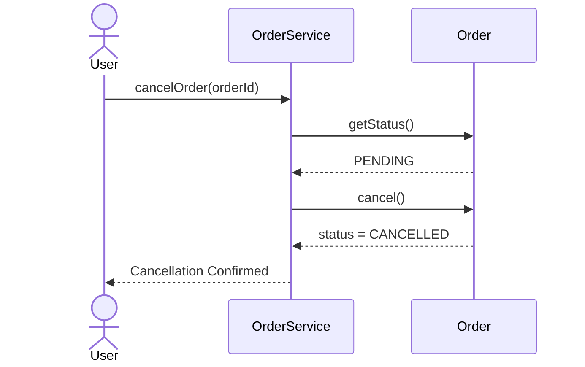

```mermaid

sequenceDiagram
    actor User
    participant OrderService
    participant Order
    
    User->>OrderService: cancelOrder(orderId)
    
    OrderService->>Order: getStatus()
    Order-->>OrderService: PENDING
    
    OrderService->>Order: cancel()
    Order-->>OrderService: status = CANCELLED
    
    OrderService-->>User: Cancellation Confirmed

```