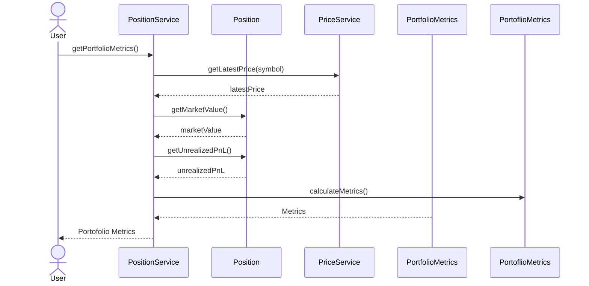

```mermaid

sequenceDiagram
    actor User
    participant PositionService
    participant Position
    participant PriceService
    participant PortfolioMetrics

    User->>PositionService: getPortfolioMetrics()

    PositionService->>PriceService: getLatestPrice(symbol)
    PriceService-->>PositionService: latestPrice

    PositionService->>Position: getMarketValue()
    Position-->>PositionService: marketValue

    PositionService->>Position: getUnrealizedPnL()
    Position-->>PositionService: unrealizedPnL

    PositionService->>PortoflioMetrics: calculateMetrics()

    PortfolioMetrics-->>PositionService: Metrics
    PositionService-->>User: Portofolio Metrics


```