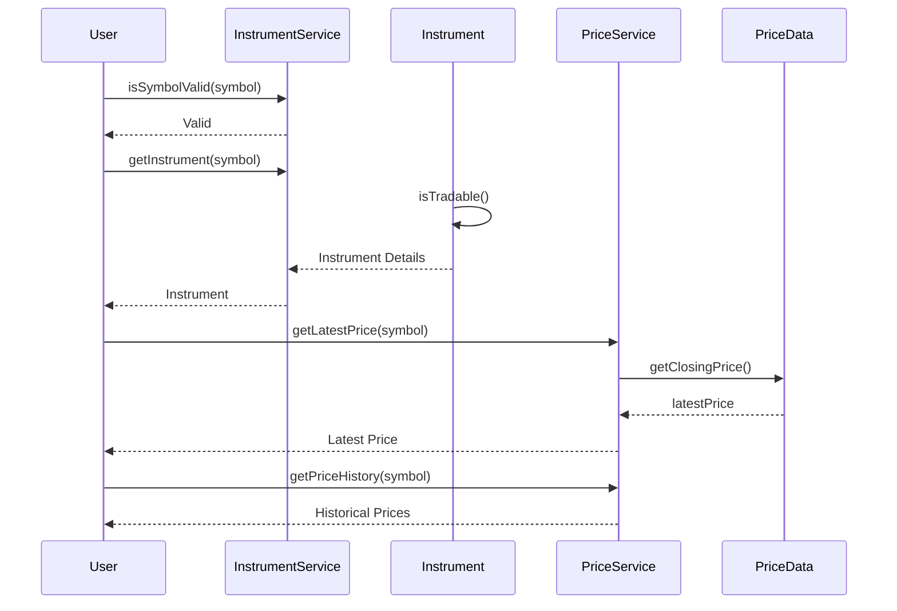

```mermaid

sequenceDiagram
    participant User
    participant InstrumentService
    participant Instrument
    participant PriceService
    participant PriceData
    
    User->>InstrumentService: isSymbolValid(symbol)
    InstrumentService-->>User: Valid
    
    User->>InstrumentService: getInstrument(symbol)
    Instrument->>Instrument: isTradable()
    
    Instrument-->>InstrumentService: Instrument Details
    InstrumentService-->>User: Instrument
    
    User->>PriceService: getLatestPrice(symbol)
    PriceService->>PriceData: getClosingPrice()
    PriceData-->>PriceService: latestPrice
    PriceService-->>User: Latest Price
    
    User->>PriceService: getPriceHistory(symbol)
    PriceService-->>User: Historical Prices
   
```