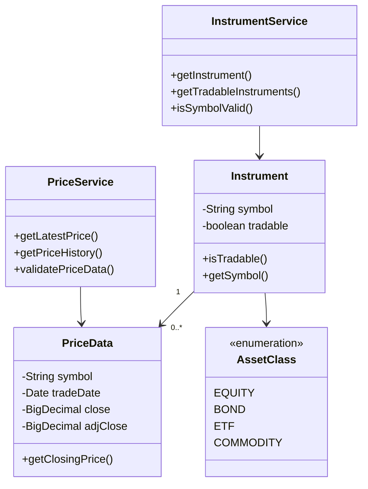

```mermaid
classDiagram
    class Instrument {
        -String symbol
        -boolean tradable
        +isTradable()
        +getSymbol()
    }

    class PriceData {
        -String symbol
        -Date tradeDate
        -BigDecimal close
        -BigDecimal adjClose
        +getClosingPrice()
    }

    class AssetClass {
        <<enumeration>>
        EQUITY
        BOND
        ETF
        COMMODITY
    }

    class InstrumentService {
        +getInstrument()
        +getTradableInstruments()
        +isSymbolValid()
    }

    class PriceService {
        +getLatestPrice()
        +getPriceHistory()
        +validatePriceData()
    }

    Instrument "1" --> "0..*" PriceData
    Instrument --> AssetClass
    InstrumentService --> Instrument
    PriceService --> PriceData

```